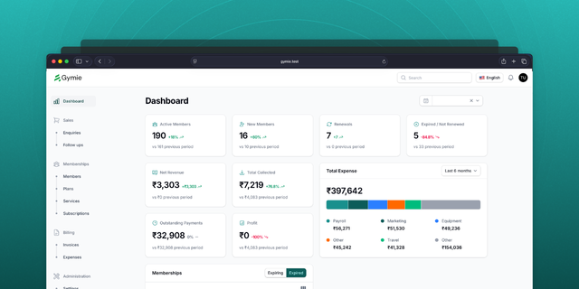

<p align="center"></p>



## Overview
Laravel based web application for gym & club management. Currently being used by many fitness centers. For more information, visit - https://www.gymie.in

Contributing or developing on the codebase? See [DEVELOPERS.md](DEVELOPERS.md).

## Requirements

-   PHP >= 8.2
-   Laravel Framework ^12.0
-   Filament Admin Panel 5.x
-   Livewire ^3.0
-   nnjeim/world ^1.1
-   barryvdh/laravel-dompdf ^3.1
-   Laravel Herd _(optional for local development)_

## Installation

To set up Gymie, follow these steps:

### 1. Clone the Repository

Clone the repository to your local system:

```bash
git clone git@github.com:JeremyBarrera/gymie
```

### 2. Go to folder

```bash
cd gymie
```

### 3. Install dependencies

```bash
composer install
```

### 4. Prepare the environment

Run the following script to prepare your environment:

```bash
composer run prepare-env
```

This will:

-   Copy `.env.example` to `.env` (if missing)
-   Clear config cache
-   Generate application key
-   Create a symbolic link to the storage folder

### 5. Configure the `.env` file

-   Set your database credentials.
-   Update other relevant configuration values.
-   Set your application URL:
    ```env
    APP_URL=https://gymie.test
    ```

> [!NOTE]
> **Owner credentials in `.env`** — the `OWNER_NAME`, `OWNER_EMAIL` and `OWNER_PASSWORD` variables are read **only** by the `UserSeeder` (`php artisan db:seed --class=UserSeeder`). They are used at initial setup and whenever you reset the database clean (e.g. `migrate:fresh` + re-seed). They are bootstrap-only: the seeder creates the owner if absent and never changes an existing account, so editing these variables never alters a running install. For a one-off manual owner, use `php artisan gymie:create-owner` instead. See [DEVELOPERS.md](DEVELOPERS.md) for the developer workflow.

### 6. Database Setup

You can set up the database in one of two ways, depending on your requirements:

**Option 1: Blank Setup (Recommended for Production)**

Run the following command:

```bash
composer run setup
```

> [!NOTE]
> This command does **not** create an administrator account. You create the owner explicitly afterwards (the owner then defines the manager / regional-admin roles) — see [Startup & First-Run Setup](#startup--first-run-setup) below.

This will:

-   Set up the environment (.env, app key, storage link)
-   Run a fresh migration to create database tables
-   Seed the world data (countries, states, cities)
-   Generate the Filament admin panel's permissions (Shield)
-   Print the first-run setup next steps (`gymie:setup-guidance`)

> [!IMPORTANT]
> **Before logging in**, create the owner account, then complete first-run setup — see [Startup & First-Run Setup](#startup--first-run-setup) below. Until then every panel page redirects to a setup-in-progress screen.

**Option 2: Demo Setup**

If you want to explore the system with all demo data preloaded, use:

```bash
composer run setup-demo
```

This command will:

-   Reset the database
-   Seed all available demo data
-   Prepare the environment automatically
-   Generate the admin panel permissions and mark first-run setup as complete (no manual first-run steps needed)

> [!CAUTION]
> This process will erase all existing data. Use it only in a local or demo environment.

Login credentials (the `.env` owner defaults):

```bash
Email: test@example.com
Password: test
```

## Quick Start (from zero)

The full sequence to get a fresh Gymie install running, in order:

```bash
# 1. Get the code and dependencies
git clone git@github.com:JeremyBarrera/gymie
cd gymie
composer install

# 2. Prepare the environment (copies .env, generates APP_KEY, links storage)
composer run prepare-env

# 3. Configure .env — database credentials, APP_URL, mail, etc.

# 4. Create the database schema and seed the world data
composer run setup
#   → prints "First-run setup is still pending" with next steps

# 5. Create the owner account (top-level administrator)
php artisan gymie:create-owner admin@example.com --name="Admin" --password="admin-password"

# 6. Mark first-run setup as complete and unlock the admin panel
php artisan gymie:complete-setup

# 7. Start the app (three terminals — server, Reverb, queue; see "Development")
#   php artisan serve --host=0.0.0.0 --no-reload
#   php artisan reverb:start
#   php artisan queue:work
# or on Windows as background daemons: .\start-dev.ps1 (stop with .\stop-dev.ps1)
```

> [!IMPORTANT]
> The **queue worker** and the **Reverb websocket server** are required for the
> live reception flow (popup on sign-up / check-in, the "waiting" page updates,
> overrides). Without them the app works but nothing updates in real time.

If you omit `--password`, the owner command generates a random password and prints it to the terminal once.

> [!TIP]
> Prefer a demo instead of the blank setup? Replace steps 4–6 with `composer run setup-demo` — it seeds demo data, creates the `test@example.com` / `test` account, and completes first-run setup automatically.

## Startup & First-Run Setup

On a fresh install the app boots into **setup mode**: until setup is completed, every admin panel page (except the login / password-reset screens) is locked and every account is sent to a standalone **setup-in-progress** screen.

### 1. Create the owner

The app has no administrator until you create one:

```bash
php artisan gymie:create-owner admin@example.com
```

```bash
php artisan gymie:create-owner admin@example.com --name="Admin" --password="a-strong-password"
```

> [!NOTE]
> When `--password` is omitted, a random password is generated and printed to the terminal once.

### 2. Complete first-run setup

```bash
php artisan gymie:complete-setup
```

This unlocks the full admin panel.

### 3. Log in

1.  Start the app (`php artisan serve --host=0.0.0.0 --no-reload` or `composer run dev`).
2.  Log in with the owner account credentials — you are now in the full admin panel.

The owner is the top-level account: it bypasses every permission and every location scope. Other roles (manager, staff, ...) are defined through normal role management and see only the locations they are assigned to via `user_locations`.

To reset setup mode (for example on another machine), remove the `dev_panel_setup` key under `general` in the settings store (`storage/data/settingsData.json` on the default JSON-backed repository) and restart.

## Reception (Check-in & Sign-up Desk)

Gymie includes a full reception desk for managing walk-in check-ins and sign-ups at the front desk.

### Admin panel page

The **Reception** page (`Reception` Filament page) is available to staff with the right roles. It shows two tabs:

-   **Check-in** — members scanning in with their contact number or government ID.
-   **Sign-Up** — visitors applying to join on the spot.

Staff can **claim** a waiting entry (so no two staff members grab the same person), then **approve** or **deny** it with a reason. Approving a check-in records a plan check-in against the member's eligible subscription and respects its use limits.

The **Override** flow lets staff approve an entry that would otherwise fail eligibility checks; the configured roles and users are notified via the follow-up alert helper (`FollowUpAlert::send` / `FollowUpAlertNotification`, recipients configurable under **Settings → Notifications**, defaulting to owners). Subscription status updates from the `gymie:subscriptions` command notify the recipients configured there as well.

### QR codes

The Reception page can generate printable QR codes per location, in either Check-in or Sign-Up mode, with configurable format (PNG/SVG) and size.

### Public member-facing pages

Locations get a token that powers the public pages:

-   `GET /checkin/{token}` — check-in scan page.
-   `GET /signup/{token}` — sign-up application page (gated by the `api.signup.apply` feature flag).
-   `POST /checkin/submit` — submits a check-in and creates a queue entry for the desk.
-   `GET /waiting/{uuid}` — "you're in the queue" status page, which live-updates when the entry is approved or denied.

### Public API (JSON, v1)

-   `POST /api/v1/checkin/lookup` — looks up a member by contact number or government ID (gated by the `api.checkin.lookup` feature flag).
-   `POST /api/v1/signup/apply` — submits a sign-up application and enqueues it for the desk (gated by the `api.signup.apply` feature flag).

### Feature flags

-   `checkin.override` — enable/disable the override approval flow on the Reception page.
-   `api.checkin.lookup` — enable/disable the public check-in lookup API endpoint.
-   `api.signup.apply` — enable/disable the public sign-up application flow (web + API).

Flags are defined in `app/Providers/PennantServiceProvider.php`, default to enabled, and are scoped per gym (tenant) with a global fallback for single-tenant installs.

## QR's

Every check-in / sign-up scan creates a **queue entry** for the reception desk. Entries stay in the active queue (`waiting` / `attending`) until staff claim and resolve them, or until their 10-minute expiry passes.

### Clearing the queue

To remove all active queue entries at once — for example at the end of the day or to reset a demo — run:

```bash
php artisan gymie:clear-queue
```

This:

-   Deletes every entry in `waiting` / `attending` status (resolved history — `approved`, `denied`, `expired` — is kept for the activity log).
-   Broadcasts an expiry event per entry, so public waiting pages and the reception desk popup update immediately instead of waiting out the 10-minute expiry.

The command asks for confirmation before deleting. Options:

-   `--location=<id>` — only clear the queue for a specific location (without it, all locations are cleared).
-   `--force` — skip the confirmation prompt (e.g. in scripts).

```bash
# Clear only location 3, no prompt
php artisan gymie:clear-queue --location=3 --force
```

## Troubleshooting

**Memory Errors**

Ensure PHP has enough memory allocated. Edit your php.ini:

```ini
memory_limit = 512M
```

**Seeder Performance**

Seeders (like WorldSeeder) can add significant data and slow down performance. For production, avoid full seeding and run only necessary seeders:

```bash
php artisan db:seed --class=WorldSeeder
```

## Development

### 1. Start the app — three terminals

The app is three always-running processes. Open three terminals in the
project folder and start one in each:

```powershell
# Terminal 1 — web server
php artisan serve --host=0.0.0.0 --no-reload

# Terminal 2 — websocket server (powers the live reception popup and waiting page)
php artisan reverb:start

# Terminal 3 — queue worker (processes queued jobs, e.g. realtime broadcasts)
php artisan queue:work
```

Keep each terminal open — closing it stops that process.

> [!NOTE]
> `--host=0.0.0.0` binds the web server to all interfaces, so phones/tablets on
> the same network can reach the app at `http://<your-LAN-IP>:8000` (find it with
> `ipconfig`). `--no-reload` activates `PHP_CLI_SERVER_WORKERS` from `.env`
> (default 4), so the single server handles parallel requests instead of
> serializing them. This one command is the whole web server — do not start
> extra `php artisan serve` processes on the same port.

> [!IMPORTANT]
> Terminals 2 and 3 are required for the realtime features (popup on
> sign-up / check-in, live waiting page). Without them the app works but
> nothing updates in real time. They must be restarted after a reboot.

`npm run dev` is only needed while developing frontend assets (hot reload);
otherwise the built assets from `npm run build` are used.

Or with Laravel Herd instead of `php artisan serve`:

```powershell
herd
```

### 2. Windows alternative — one command, background daemons

If you don't want to babysit three terminals, run everything in the
background (survives terminal close):

```powershell
# from the project folder, in any PowerShell window:
cd C:\path\to\gymie

.\start-dev.ps1      # starts serve + reverb + queue (Vite optional: -Vite)
.\stop-dev.ps1       # stops what start-dev.ps1 launched
```

`start-dev.ps1` is idempotent — already-running processes are detected and
skipped — and writes logs to `storage/logs/gymie-*.log`. `stop-dev.ps1` only
stops the processes `start-dev.ps1` launched (it reads
`storage/logs/.gymie-dev.pids.json`), so processes started manually in your
own terminals are left alone.

> [!NOTE]
> If PowerShell blocks the script ("execution policy"), allow scripts for your
> user once: `Set-ExecutionPolicy -Scope CurrentUser RemoteSigned`.
> Or run it without changing the policy:
> `powershell -ExecutionPolicy Bypass -File .\stop-dev.ps1`

### 3. Start the Laravel scheduler

```bash
php artisan schedule:work
```

> [!NOTE]
> The scheduler must be running continuously to trigger time-based tasks (e.g., status updates).
>
> If those tasks dispatch queued jobs (like import/export or notifications), then the queue worker must also be running to process them.

## Production

The app is a small stack of always-running processes. Do **not** run them from
a terminal in production — each one must be supervised (auto-restart on crash
or reboot):

| Process             | Command                    | Purpose                                                       |
| ------------------- | -------------------------- | ------------------------------------------------------------- |
| Web server          | `php artisan serve` / Nginx / PHP-FPM | serves HTTP                                            |
| Queue worker        | `php artisan queue:work --sleep=1 --tries=3` | processes queued jobs (broadcasts, imports, notifications) |
| Reverb              | `php artisan reverb:start` | websocket server for the live reception flow and waiting page |

### Process supervision

With [supervisor](http://supervisord.org/) (`/etc/supervisor/conf.d/gymie.conf`):

```ini
[program:gymie-queue]
command=php /var/www/gymie/artisan queue:work --sleep=1 --tries=3
directory=/var/www/gymie
autostart=true
autorestart=true
user=www-data

[program:gymie-reverb]
command=php /var/www/gymie/artisan reverb:start
directory=/var/www/gymie
autostart=true
autorestart=true
user=www-data
```

Or with systemd — equivalent units under `[Service]`:
`ExecStart=php /var/www/gymie/artisan queue:work --sleep=1 --tries=3` and
`ExecStart=php /var/www/gymie/artisan reverb:start`, plus `Restart=always`.

### Reverb behind a reverse proxy

Reverb speaks raw WebSocket on port 8080. If Nginx fronts it, the proxy must
pass the upgrade headers through:

```nginx
location /app/ {
    proxy_pass http://127.0.0.1:8080;
    proxy_http_version 1.1;
    proxy_set_header Upgrade $http_upgrade;
    proxy_set_header Connection "upgrade";
    proxy_set_header Host $host;
}
```

Terminate TLS at the proxy so browsers connect over `wss://` (see env vars below).

### Production environment variables

| Variable                | Value                                        |
| ----------------------- | -------------------------------------------- |
| `REVERB_HOST`           | public hostname the browser connects to      |
| `REVERB_SCHEME`         | `https` (TLS terminated at the proxy)        |
| `REVERB_PORT`           | `443` (or leave `8080` if proxied on a subdomain) |
| `VITE_REVERB_HOST`      | same public hostname — **must match** `REVERB_HOST` |
| `VITE_REVERB_SCHEME`    | `https`                                      |
| `REVERB_SCALING_ENABLED`| `false` on a single server (no Redis needed) |

After changing `VITE_*` variables, rebuild the frontend bundle:
`npm run build`.

### Scaling

- **Single server** (default): `REVERB_SCALING_ENABLED=false`, no Redis
  required anywhere — broadcasts flow PHP → Reverb → browsers directly.
- **Multiple nodes**: set `REVERB_SCALING_ENABLED=true` and point
  `REDIS_HOST` at a shared Redis. Every web node, queue worker and Reverb
  node must share the same Redis so broadcasts fan out across nodes.

### Docker deployment (Phase 10)

The repo ships a full compose stack (app, webserver, db, redis, reverb,
queue worker, scheduler, nightly DB backups):

```bash
cp .env.example .env      # fill in DB_PASSWORD, APP_KEY, QR_BASE_URL, ...
docker compose up -d      # builds the app image, starts everything
docker compose exec app php artisan migrate --force   # migrations are NEVER automatic
```

- Migrations are deliberately **not** run at container start - always apply
  them explicitly against a tested database copy first.
- Nightly backups land in the `backups` volume at 03:00
  (`docker compose run --rm -v backups:/backups alpine ls /backups`).
- HTTPS via DuckDNS + Let's Encrypt: fill `DUCKDNS_DOMAIN` /
  `LETSENCRYPT_EMAIL` in `.env`, swap `docker/nginx-tls.conf` into the
  webserver service, then `docker compose --profile https up -d certbot`.

### Environment separation & data refresh (Phase 10.5)

Production and dev run **separate stacks, databases, Redis and storage** -
they never share a live database. To pull a sanitized production copy into
dev (dump, transfer, load, PII masking, migrations):

```bash
./scripts/refresh-dev-data.sh user@prod-host          # local dev stack
./scripts/refresh-dev-data.sh user@prod-host user@dev-host
```

Dev data is disposable; production data is never modified by this script.

## API (JSON, v1)

Gymie ships with a versioned JSON API under `routes/api.php` for integrations.

### Authentication (Sanctum Bearer Tokens)

-   Login: `POST /api/v1/auth/login`
-   Current user: `GET /api/v1/me`
-   Logout: `POST /api/v1/auth/logout`

Example:

```bash
curl -sX POST "$APP_URL/api/v1/auth/login" \
  -H "Accept: application/json" \
  -H "Content-Type: application/json" \
  -d '{"email":"user@example.com","password":"password"}'
```

Use the returned token:

```bash
curl -s "$APP_URL/api/v1/me" \
  -H "Accept: application/json" \
  -H "Authorization: Bearer <token>"
```

Notes:

-   The API is bearer-token only. Being logged into Filament in the browser does not authenticate API requests.
-   `/api/v1/me` always includes roles and permissions. Other user endpoints include permissions only when requested:
    -   `GET /api/v1/users?include=permissions` or `GET /api/v1/users?include_permissions=1`

### Index Query Parameters (Rich Filtering)

All index endpoints support allowlisted query params:

-   Search: `?q=...`
-   Pagination: `?page=...&per_page=...`
-   Sort (multi-sort): `?sort=-created_at,name`
-   Soft deletes (where supported): `?trashed=with|only`
-   Includes (allowlisted): `?include=service,subscription.member`
-   Filters (allowlisted): `?filter[field]=value`
    -   Range syntax for date/datetime: `?filter[date]=2026-03-01..2026-03-31`

Allowlists (searchable/sortable/includes/filters) are defined per resource in:

-   `app/Services/Api/Schemas/*Schema.php` via `::queryRules()`

## Meet Your Artisans

[LUBUS](https://lubus.in/?utm_source=github&utm_medium=open-source&utm_campaign=laravel-gymie-v3) is a web design agency based in Mumbai.

<a href="https://cal.com/lubus">

</a>

## License

Gymie is an open-sourced saas licensed under the [MIT license](LICENSE)
